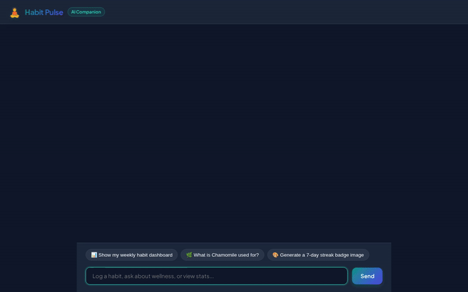

# Habit Pulse — Daily Habit & Wellness Companion 🧘

Habit Pulse is an AI-powered daily habit tracking and wellness companion built with the Google Cloud Agent Development Kit (ADK) and deployed to Agent Runtime. It combines persistent database tracking, long-term memory, RAG retrieval, image generation, code execution, and rich visual cards into a seamless conversational chat interface.



---

## 🌟 Capabilities & Wired Google Cloud Services

Habit Pulse is powered by the following Google Cloud services, AI models, and ADK tool integrations:

### 1. 🗄️ Google Cloud Firestore Persistence
- **Backend Storage**: Uses `google-cloud-firestore` to persist user habit records, target goals, completion dates, and status in the Firestore collection `habit_entries`.
- **Wired Tools**:
  - `log_habit`: Logs habit progress for today, yesterday, or specific dates; updates target statuses and computes consecutive day streaks.
  - `get_daily_summary`: Retrieves habit progress summaries for a specific date from Firestore.
  - `get_weekly_dashboard`: Generates a full 7-day habit completion matrix table from Firestore.
  - `create_habit`: Creates new habit targets with custom numerical goals and units.
  - `get_streak_analytics`: Calculates streak consistency and total completion statistics from Firestore history.

### 2. 🪣 Google Cloud Storage (GCS) CSV Export
- **Report Export**: `export_habit_report_to_gcs` compiles all recorded habit entries from Firestore into a CSV spreadsheet and uploads it to a public Google Cloud Storage bucket (`habit-pulse-assets-qwiklabs-gcp-01-4891f3ba97eb`), returning a download link.

### 3. 🧠 Vertex AI Memory Bank (Long-Term Cross-Session Memory)
- **Memory Persistence**: Integrates `PreloadMemoryTool` and an `after_agent_callback` (`generate_memories_callback`) to save user goals, health preferences, and habit streaks to Vertex AI Memory Bank across separate sessions.

### 4. 📚 Vertex AI RAG Engine (Herbal Knowledge Base)
- **Vector Retrieval**: Grounded on *Culpeper's Complete Herbal* using a serverless Vertex AI RAG Corpus (`projects/23053264641/locations/us-central1/ragCorpora/633274717133864960`).
- **Wired Tool**: `consult_herbal_knowledge` queries the RAG Corpus for natural remedies, plant properties, and wellness facts.

### 5. 🎨 Image Generation (`gemini-3.1-flash-lite-image`)
- **Milestone Badges**: `generate_habit_badge_image` uses `gemini-3.1-flash-lite-image` in the `global` region to generate visual habit achievement badges and celebration cards.
- **Artifact & GCS Upload**: Saves generated image bytes to `ToolContext` artifacts and uploads them to public Cloud Storage, returning public HTTPS URLs.

### 6. 💻 Agent Engine Sandbox Code Execution
- **Python Execution**: Equipped with `AgentEngineSandboxCodeExecutor` for safe execution of Python scripts in an Agent Engine sandbox.

### 7. 🎴 A2UI (Agent-to-User Interface v0.8)
- **Rich Display UI**: Configured with `A2uiSchemaManager` (v0.8), `BasicCatalog`, and `a2ui_callback` to format model outputs into dynamic cards, progress tables, and inline badge images.

### 8. 🌐 Public API Tool Integration
- **Daily Quotes**: `fetch_daily_wellness_quote` integrates with the public ZenQuotes REST API to return real-time motivational quotes.

---

## 📁 Repository Structure

```
habit-pulse/
├── app/
│   ├── agent.py               # Main ADK Agent definition, Firestore DB logic, tools & callbacks
│   ├── a2ui_utils.py          # A2UI renderer callback & schema formatter
│   └── fast_api_app.py        # Agent FastAPI deployment entrypoint
├── frontend/
│   ├── main.py                # FastAPI proxy server connecting browser UI to Agent Runtime over A2A
│   ├── Procfile               # Cloud Run web server execution command
│   └── static/
│       └── index.html         # Dark glassmorphic chat UI with quick prompt pills
├── agents-cli-manifest.yaml   # Agent Runtime manifest (acli 1.1.0, python, us-east1)
├── deployment_metadata.json   # Remote Reasoning Engine resource mapping
├── demo.gif                   # Looping preview GIF of live agent demo
└── README.md                  # Project documentation
```

---

## 🛠️ Setup & Running Locally

### Prerequisites
- Python 3.10+
- Google Cloud SDK (`gcloud`) authenticated with your project

### 1. Install Dependencies
```bash
python3 -m venv .venv
source .venv/bin/activate
pip install -r app/requirements.txt
pip install -r frontend/requirements.txt
```

### 2. Run the Local Proxy & UI Server
Set the Reasoning Engine resource name from your deployment metadata and start the proxy server:

```bash
export AGENT_ENGINE_RESOURCE_NAME="projects/<YOUR_PROJECT_ID>/locations/us-east1/reasoningEngines/<YOUR_REASONING_ENGINE_ID>"
export AGENT_DIRECTORY="app"
uvicorn frontend.main:app --host 0.0.0.0 --port 8080
```

Access the local chat UI by opening your browser to port `8080` on localhost.

### 3. Deploying Frontend to Cloud Run
To deploy the frontend proxy service to Google Cloud Run:

```bash
gcloud run deploy habit-pulse-frontend \
  --source ./frontend \
  --region us-east1 \
  --allow-unauthenticated \
  --set-env-vars AGENT_ENGINE_RESOURCE_NAME="$AGENT_ENGINE_RESOURCE_NAME",AGENT_DIRECTORY="app"
```
